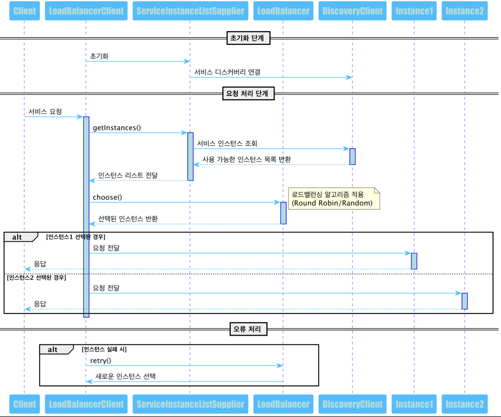

## 기능 사항 정리

- 로드밸런스 시스템을 위해서는 3가지의 요소가 필요함
    - 서비스 서버를 탐지, 발견해줄 Service Discovery
    - 서비스 서버로의 트래픽 분산을 위한 LoadBalancer
    - 서비스의 트래픽을 분산해서 받을 서비스 서버
- 이번에는 한정적인 자원에서 효율적인 로드밸런스 서버를 구현하기위해 Service Discovery와, Service Server는 더미로 설정.
    - 이로 인해, 로드밸런서 서버에 서비스 서버를 추가, 삭제만 할 수 있는 별도의 설정을 추가.

## 로드밸런스 전체 흐름도


## 사용법

### 도커컴포즈 버전

- 도커 컴포즈 버전은 3입니다.
  - 도커 컴포즈 실행 
    -  docker-compose up --build

- LoadBalancerTestController를 사용하여 로드밸런스를 시뮬레이션 할 수 있습니다.
- `resources/TestRestAPI.http` 파일을 통해 아래 동작들을 수행 가능합니다.

1-1. runit-service의 모든 인스턴스 조회

```sql
GET http://localhost:8080/loadbalancer/instances?serviceId=runit-service
```

1-2. nh-service의 모든 인스턴스 조회

```sql
GET http://localhost:8080/loadbalancer/instances?serviceId=nh-service
```

2-1. 인스턴스 선택 (runit-service 라운드로빈 로드밸런싱 테스트)

```sql
GET http://localhost:8080/loadbalancer/choose?serviceId=runit-service
```

2-2. 인스턴스 선택 (nh-service 랜덤 로드밸런싱 테스트)

```sql
GET http://localhost:8080/loadbalancer/choose?serviceId=nh-service
```

3. 새로운 인스턴스 추가

```sql
POST http://localhost:8080/loadbalancer/instances
Content-Type: application/json

{
  "serviceId": "runit-service",
  "instanceId": "21",
  "host": "runit-service",
  "port": 9084,
  "secure": false
}
```

4. 인스턴스 제거

```sql
DELETE http://localhost:8080/loadbalancer/instances/2
```

5.블락킹 Rest API 테스트

```sql
GET http://localhost:8080/loadbalancer/interceptor
```

6.논블락킹 Rest API 테스트

```sql
GET http://localhost:8080/loadbalancer/filter
```

# 고민사항
1. Sticky Session
2. Reyry
3. Health Check
4. 캐시 기능
